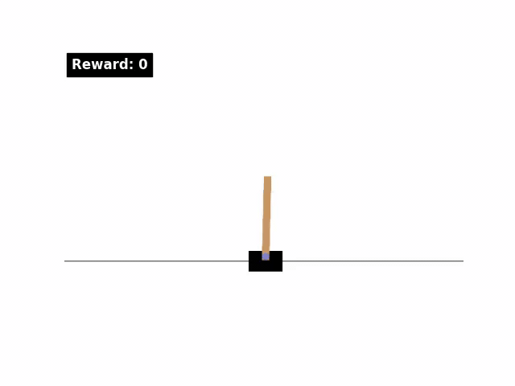
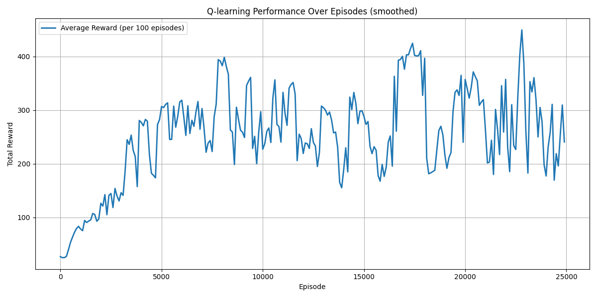

# Q-Learning on CartPole (Gymnasium)

This project implements **tabular Q-Learning** to solve the [CartPole-v1](https://gymnasium.farama.org/environments/classic_control/cart_pole/) task in Gymnasium.  
States are **discretized** into bins and stored in a 4D Q-table.

---

## Project Overview
- **Environment:** CartPole-v1 (Gymnasium)
- **Algorithm:** Tabular Q-Learning with epsilon-greedy exploration
- **State:** Continuous → discretized into bins
- **Reward:** +1 per timestep the pole stays up
- **Goal:** Maximize episode length (keep pole balanced)

---

## Key Idea: Threshold-Gated, Episodic Q-Updates
Instead of updating the Q-table every step, transitions are collected for the whole episode and **only applied if the episode’s total reward exceeds a threshold**.  
This prevents low-reward (bad) episodes from negatively affecting the learned policy.

- Start with `reward_threshold = 5`.
- After each episode:
  - If `total_reward > reward_threshold`, run the **Q-learning update over all episode transitions**, then decay epsilon.
  - Every 200 episodes, if reward threshold is below `450`, **raise the threshold by +5**.
  - After 5000 episodes, reduce learning rate: `alpha = 0.05`.

---

## Trained Agent Visualization

  

> The GIF shows **8 separate episodes** of the trained agent keeping the pole balanced.

**Note:** MP4 video export using `matplotlib.animation` requires **FFmpeg installed on the system**. Python packages alone (`matplotlib`, `gymnasium`, `numpy`) are sufficient for training, plotting rewards, and in-memory animation, but saving MP4 files will fail if FFmpeg is missing.

---

## Training Performance

  

> The plot shows the **average total reward per 100 episodes**, smoothed to visualize learning progress.

---

## Requirements

- See `requirements.txt` for Python package dependencies.  
- Python 3.11.13 recommended.

---

## Files

- `qlearning.py` → Q-learning class and functions
- `agent.py` → Execution script
- `qlearning_cartpole.gif` → GIF showing 8 separate episodes of the trained agent
- `training_rewards.png` → Plot of average reward progression over training  
- `q_matrix.npy` → Saved Q-table (pretrained, can be used without retraining)  
- `requirements.txt` → Python dependencies
---
